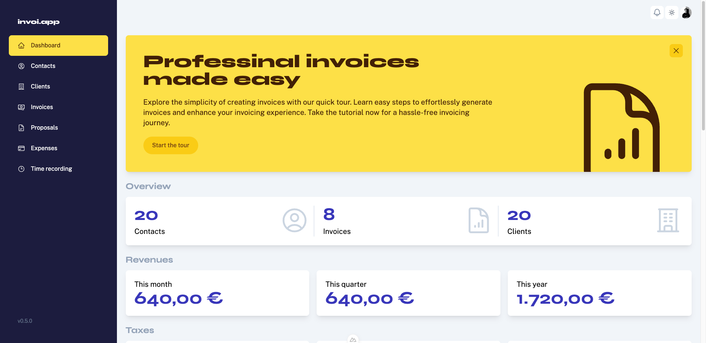

# invoi.app

This repository holds the frontend code of invoi.app. You can find the backend code [here](https://github.com/MogliCodes/invoi-backend).

**Professional invoices made easy**



## The story behind invoi.app

invoi is a side project I started years ago when I was still doing mostly freelance gigs. At the time I was using
InDesign to create invoices, which was very error prone and time consuming. I wanted to create a simple web app that
would allow me to create invoices quickly and easily.

During the process of developing this app, I have started over with a fresh code base 2 times, and thought about doing
it again a lot of times. If I started this project today, I would do many things differently now.

Here are some things I would approach differently today

**1. Database Choice**

When I started the project I went with MongoDB because that was what was used in all the tutorials I watched back then. I also liked the flexibility of MongoDB and being able to just add another property to a collection on the fly. Nowadays, I like designing database schemas, because it makes me think more about requirements and features.

**2. Monolithic Architecture**

Having a seperate frontend and backend may be a good approach when working on a large project with multiple developers.
But since I am the sole developer and only user of this app and I don't intend to make it publicly available anymore, I maybe would have backend and frontend in one codebase. It would make developing features much less repetitive.

**3. UI Library**
After many years of building complex UIs professionally, it is not that exciting challenge anymore. I am more interested in bigger picture architectures, automating processes and all that good stuff. Today I would choose a UI library or even a complete template starter kit to save the time of creating dozens of components.


## Development

### Feature Toggles

invoi.app uses feature toggles to enable or disable certain features in the navigation menu. The core features (
Dashboard, Kontakte, Kunden, Rechnungen) are always available, while other features can be toggled on or off using
environment variables.

#### Available Feature Toggles

| Environment Variable               | Description                  | Default |
|------------------------------------|------------------------------|---------|
| NUXT_PUBLIC_FEATURE_SERVICES       | Enable/disable Leistungen    | false   |
| NUXT_PUBLIC_FEATURE_PROPOSALS      | Enable/disable Angebote      | false   |
| NUXT_PUBLIC_FEATURE_REVENUES       | Enable/disable Einkünfte     | false   |
| NUXT_PUBLIC_FEATURE_EXPENSES       | Enable/disable Ausgabe       | false   |
| NUXT_PUBLIC_FEATURE_TIME_RECORDING | Enable/disable Zeiterfassung | false   |

### How to Use

1. Copy the `.env.example` file to `.env`
2. Set the desired feature toggles to `true` to enable them
3. Restart the application

Example:

```
# Enable Leistungen and Angebote, disable others
NUXT_PUBLIC_FEATURE_SERVICES=true
NUXT_PUBLIC_FEATURE_PROPOSALS=true
NUXT_PUBLIC_FEATURE_REVENUES=false
NUXT_PUBLIC_FEATURE_EXPENSES=false
NUXT_PUBLIC_FEATURE_TIME_RECORDING=false
```