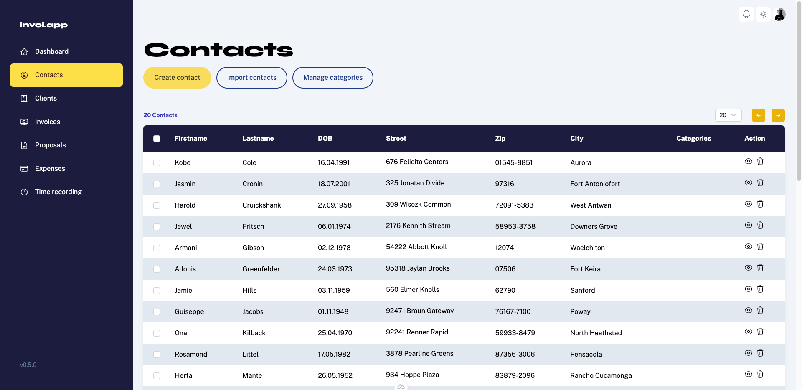

# invoi.app
**Professional invoices made easy**


## The story behind invoi.app
invoi is a side project I started years ago when I was still doing mostly freelance gigs. At the time I was using InDesign to create invoices, which was very error prone and time consuming. I wanted to create a simple web app that would allow me to create invoices quickly and easily. 

## Features

### Manage contacts


### Manage clients

### Create invoices

### Create proposals

### Keep track of expenses

### Track your working hours

# Nuxt 3 Minimal Starter

Look at the [Nuxt 3 documentation](https://nuxt.com/docs/getting-started/introduction) to learn more.

## Setup

Make sure to install the dependencies:

```bash
# yarn
yarn install

# npm
npm install

# pnpm
pnpm install
```

## Development Server

Start the development server on http://localhost:3000

```bash
npm run dev
```

## Production

Build the application for production:

```bash
npm run build
```

Locally preview production build:

```bash
npm run preview
```

Check out the [deployment documentation](https://nuxt.com/docs/getting-started/deployment) for more information.
